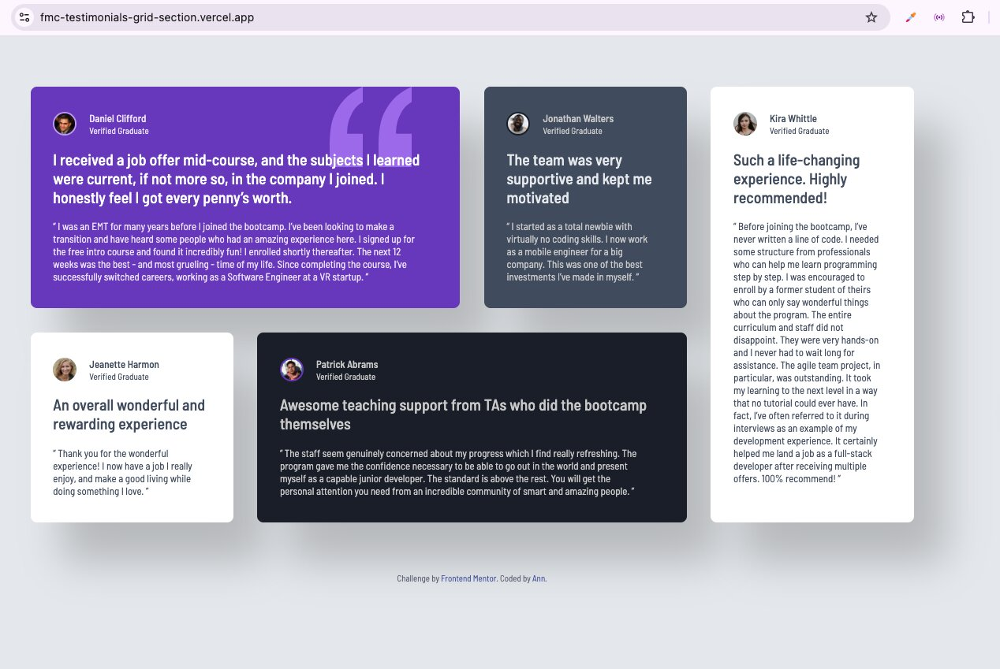

# Frontend Mentor - Testimonials grid section solution

This is a solution to the [Testimonials grid section challenge on Frontend Mentor](https://www.frontendmentor.io/challenges/testimonials-grid-section-Nnw6J7Un7). Frontend Mentor challenges help you improve your coding skills by building realistic projects. 

## Table of contents

- [Frontend Mentor - Testimonials grid section solution](#frontend-mentor---testimonials-grid-section-solution)
  - [Table of contents](#table-of-contents)
  - [Overview](#overview)
    - [The challenge](#the-challenge)
    - [Screenshot](#screenshot)
    - [Links](#links)
  - [My process](#my-process)
    - [Built with](#built-with)
    - [What I learned](#what-i-learned)
    - [AI Collaboration](#ai-collaboration)
  - [Author](#author)
  - [Acknowledgments](#acknowledgments)

## Overview

### The challenge

Users should be able to:

- View the optimal layout for the site depending on their device's screen size

### Screenshot

### Links

- Solution URL: [here](https://your-solution-url.com)
- Live Site URL: [here](https://fmc-testimonials-grid-section.vercel.app/)

## My process

### Built with

- Semantic HTML5 markup
- Sass (SCSS) preprocessor
- CSS custom properties
- Flexbox
- CSS Grid
- Mobile-first workflow

### What I learned

I refreshed my knowledge of the technologies listed above.

### AI Collaboration

I used Microsoft Copilot, ChatGPT, and GitHub Copilot (Codex-based suggestions) to help with brainstorming, generating boilerplate code and debugging. All final code was reviewed and refined manually.

## Author

- Frontend Mentor - Ann [@anntnt](https://www.frontendmentor.io/profile/anntnt)

## Acknowledgments

This is where you can give a hat tip to anyone who helped you out on this project. Perhaps you worked in a team or got some inspiration from someone else's solution. This is the perfect place to give them some credit.

**Note: Delete this note and edit this section's content as necessary. If you completed this challenge by yourself, feel free to delete this section entirely.**
